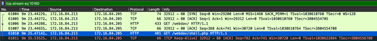

### Blue Team 
In order to complete the Blue team portion of the capstone you will already need to have infiltrated the vulnerable machine, and have received the snort log. 

**Objectives**
- How long did the attack last?
The attack started when the TCP scan was initiated (NMAP)in the third and fourth frames. 


The attack ended when the PHP shell was activated in frame 61010. 


**Therefore, the attack lasted roughly 9 minutes and 25 seconds.**

- How many password attempts were made?
There were 10,143 password cracking attempts made with hydra.
```
http.user_agent == "Mozilla/4.0 (Hydra)"
```
  

- What time was the correct password found? 
The correct password was detected by hydra at the 4 minute and 44th second mark. 
```
http.authbasic == "ashton:leopoldo" && http.user_agent == "Mozilla/4.0 (Hydra)"
```


- What time was the shell placed onto the server?
```
http.request.uri contains "shell.php" && http.request.method == "PUT"
```


**The attacker placed the reverse PHP shell on the webdav server at the 7 minute and 36th second mark, however, based on the network traffic it looked like he struggled first and deleted his first shell. Also, he used the Gnome Virtual File System (GVFS) to connect to the webdav server and upload the malicious script. See below:**


- What time was the shell activated?
```
http.request.uri contains "shell.php" && http.request.method == "GET"
```
**The PHP script is run simply by browsing to the newly uploaded file in the web browser. This can be seen as a GET request in the captured network traffic. The shell was activated at the 9 minute and 25 second mark. See below:**


